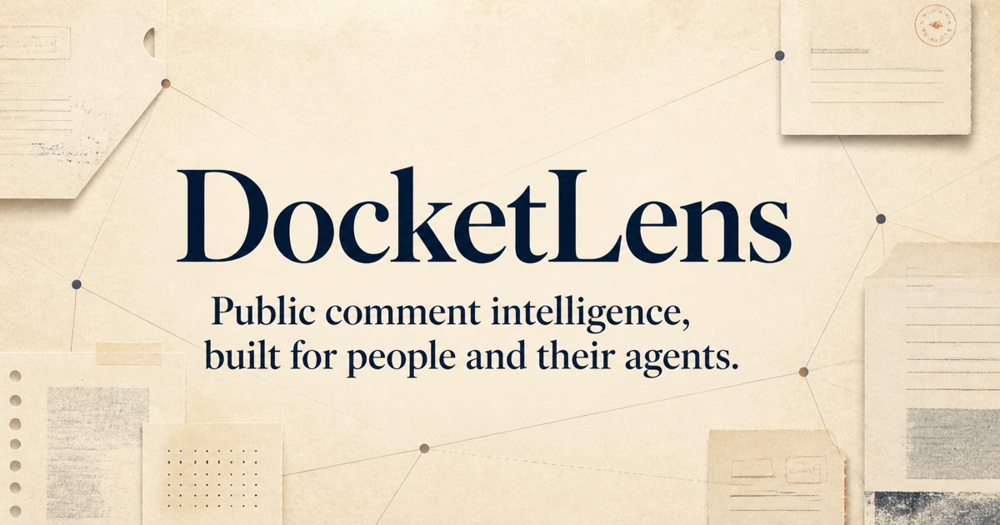

# DocketLens

**Public comment intelligence, built for people and their agents.**

DocketLens is a WebMCP-native research workspace for large U.S. federal regulatory dockets. It turns thousands of public submissions into a shared, source-linked workspace where an AI agent can search, inspect, compare, tag, and pin evidence while a person reviews the exact original material and controls the final brief.

The default experience uses the real U.S. Copyright Office docket **COLC-2023-0006 — Artificial Intelligence and Copyright**, with more than 10,000 public comments. No demo records are fabricated.



## Why this is useful

Public-interest researchers, journalists, policy teams, law firms, trade groups, and civil-society organizations routinely need to understand large public-comment records. Today that means repetitive searching, opening many documents, copying passages, and manually preserving citations. General-purpose chat can summarize a topic, but it usually does not share a live research state with the analyst or make every claim easy to trace back to an official record.

DocketLens keeps the speed of an agent and the accountability of source-based research:

- every result is fetched live from Regulations.gov;
- every evidence pin contains an exact excerpt and official source URL;
- agent-created pins remain visibly **pending human review**;
- the final Markdown brief is prepared in the page and exported only by the human;
- the app is read-only and never files a government comment.

## Why WebMCP matters

Without WebMCP, an agent must visually guess where search boxes, result cards, tabs, and citation controls are. It may lose the page's current state or copy the wrong passage. DocketLens exposes the product's real research actions as narrow structured tools. The agent and person operate the same live workspace, so actions are immediately visible, reversible, and reviewable.

| WebMCP tool | Product action |
| --- | --- |
| `load_regulatory_docket` | Load a real Regulations.gov docket and its notices |
| `search_public_comments` | Search only within the loaded docket |
| `inspect_public_comment` | Open one official submission with attachments and metadata |
| `tag_visible_comments` | Organize visible records by research theme |
| `pin_source_excerpt` | Add a verbatim, source-validated passage to the evidence board |
| `compare_public_comments` | Open two or three submissions side by side |
| `get_research_workspace_state` | Read the human's current docket, search, selection, tags, and evidence state |
| `prepare_evidence_brief` | Assemble a cited Markdown brief for human review |

The implementation uses the imperative WebMCP API, `document.modelContext.registerTool(...)`, supported by ChatGPT's in-app browser. Tool inputs use strict schemas, public source content is marked untrusted, and source excerpts are checked against the fetched record before they can be pinned.

## Architecture

```text
ChatGPT agent ── WebMCP tools ──► live DocketLens workspace
                                      │
Human analyst ◄── visible shared state ┤
                                      │
                               server-side proxy
                                      │
                              Regulations.gov API v4
```

The browser never receives the upstream API key. `/api/regulations` permits only read-only GET operations, validates docket/comment identifiers, caps result sizes, removes sensitive contact fields, allow-lists official attachment hosts, and returns a small public data shape.

## Run locally

Requirements: Node.js 22.13 or later and a free [data.gov API key](https://api.data.gov/signup/).

```bash
cp .env.example .env.local
# Add your REGULATIONS_GOV_API_KEY to .env.local
npm install
npm run dev
```

Open the local URL in Chrome with WebMCP testing enabled, or deploy it and use ChatGPT's in-app browser. A limited `DEMO_KEY` fallback is available, but it is rate-limited and not suitable for a public deployment.

## Verify

```bash
npm run lint
npm run build
```

Then verify:

1. the default docket loads from Regulations.gov;
2. searching `OpenAI` and `Authors Guild` returns real public records;
3. the browser reports eight registered WebMCP tools;
4. an agent-created evidence pin is marked pending until a human verifies it;
5. brief export includes official Regulations.gov links.

## Privacy and safety

- Read-only: DocketLens does not submit or modify government records.
- Source-bound: excerpts must exist in the fetched submission text.
- Human-controlled: agent evidence is clearly labeled and export is a human action.
- Secret-safe: the data.gov key stays in server runtime configuration.
- Public-record minimization: contact fields such as email, phone number, and address are never returned by the proxy.

## License

[MIT](LICENSE)
